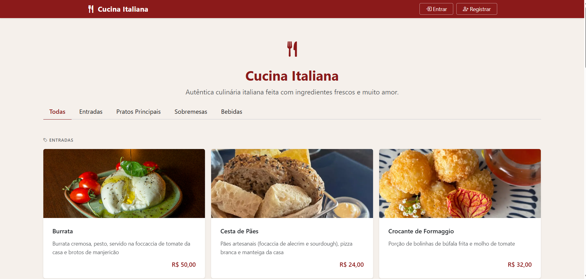
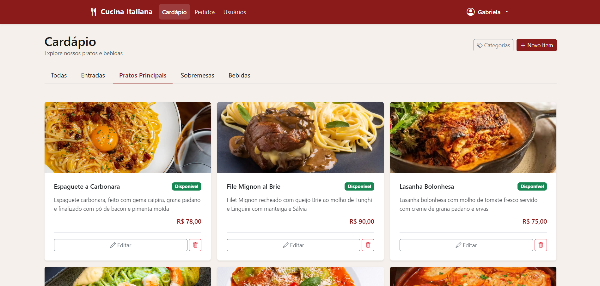
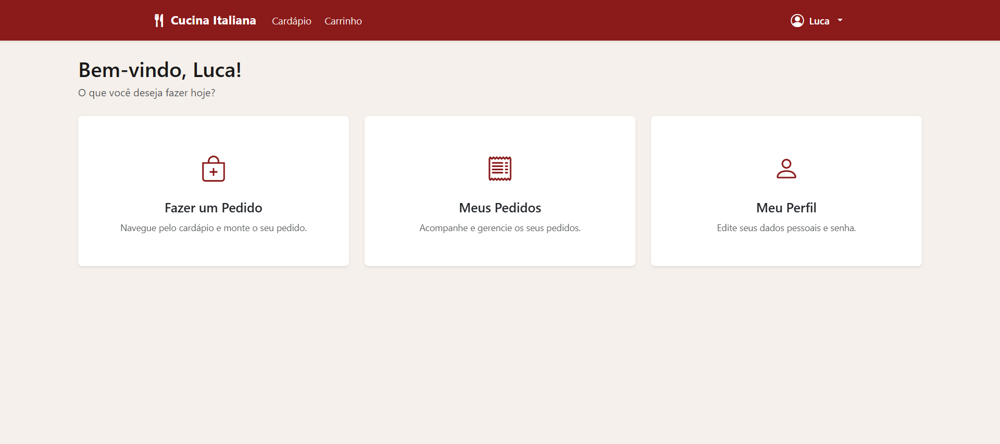

# Cucina Italiana — Frontend

Interface web do sistema de pedidos do restaurante **Cucina Italiana**, desenvolvida como Trabalho 2 da disciplina de Programação para Web (INF1407) da PUC-Rio.

O sistema permite que visitantes naveguem pelo cardápio publicamente, clientes montem e acompanhem pedidos, atendentes gerenciem a fila em tempo real e gerentes administrem o cardápio e os usuários do sistema. Toda a lógica é escrita em TypeScript e compilada para JavaScript.

**Autora:**
- Gabriela Soares de Moraes

---

## Tecnologias Utilizadas

| Tecnologia | Uso |
|---|---|
| HTML5 | Marcação das páginas |
| CSS3 + Bootstrap 5 (CDN) | Estilização e responsividade |
| Bootstrap Icons (CDN) | Ícones da interface |
| TypeScript | Todo o código JavaScript do projeto (compilado para JS) |
| Fetch API | Comunicação com o backend |
| localStorage | Persistência do token e dados de sessão |
| Python http.server | Servidor de desenvolvimento local |

---

## Escopo do Site

O **Cucina Italiana** é uma interface web que se comunica com a API REST do backend. Cada perfil de usuário enxerga um conjunto de páginas e ações distinto.

### Perfis de Usuário e Permissões

| Funcionalidade | Visitante | Cliente | Atendente | Gerente |
|---|:---:|:---:|:---:|:---:|
| Ver cardápio público | ✅ | ✅ | ✅ | ✅ |
| Registrar conta | ✅ | — | — | — |
| Login / Logout | ✅ | ✅ | ✅ | ✅ |
| Recuperar senha por e-mail | ✅ | ✅ | ✅ | ✅ |
| Adicionar itens ao carrinho e fazer pedido | — | ✅ | — | — |
| Acompanhar os próprios pedidos | — | ✅ | — | — |
| Gerenciar cartões salvos | — | ✅ | — | — |
| Editar dados pessoais e trocar senha | — | ✅ | ✅ | ✅ |
| Ver fila de pedidos e avançar status | — | — | ✅ | ✅ |
| Gerenciar categorias do cardápio | — | — | — | ✅ |
| Criar/editar/excluir itens do cardápio | — | — | — | ✅ |
| Gerenciar usuários (alterar perfil) | — | — | — | ✅ |
| Ver todos os pedidos (com filtros) | — | — | — | ✅ |

#### Visitante (não autenticado)
Acessa a página inicial e navega pelo cardápio completo organizado em abas por categoria (Entradas, Pratos Principais, Sobremesas, Bebidas). Pode se registrar ou fazer login para acessar as funcionalidades completas.

#### Cliente
Acessa o cardápio para montar pedidos, acompanha o histórico e status de seus pedidos, gerencia cartões de crédito/débito salvos e edita seus dados pessoais.

#### Atendente
Ao fazer login, é redirecionado para o dashboard com acesso à fila de pedidos. Pode filtrar pedidos por status e avançar o andamento de cada um pelo fluxo: *Recebido → Em Preparo → Pronto → Entregue*.

#### Gerente
Tem acesso completo ao sistema: gerencia categorias e itens do cardápio (incluindo upload de foto e controle de disponibilidade), visualiza todos os pedidos com filtros, gerencia os perfis de todos os usuários cadastrados e pode excluir pedidos.

---

## Imagens

**Página inicial para visitantes não autenticados — cardápio público com navegação por abas de categoria:**



**Cardápio na visão do gerente — botões de criação e edição de itens integrados à listagem:**



**Dashboard do cliente após login — acesso rápido a pedidos, cartões e perfil:**



---

## Estrutura de Páginas

| Página | Quem acessa | Descrição |
|---|---|---|
| `index.html` | Todos | Página inicial; cardápio público para visitantes, dashboard para logados |
| `login.html` | Visitante | Formulário de login |
| `registro.html` | Visitante | Criação de nova conta (cliente) |
| `esqueci-senha.html` | Visitante | Solicitar recuperação de senha por e-mail |
| `redefinir-senha.html` | Visitante | Definir nova senha com token do e-mail |
| `perfil.html` | Autenticados | Visualizar e editar dados pessoais |
| `trocar-senha.html` | Autenticados | Alterar senha estando logado |
| `cardapio.html` | Autenticados | Cardápio com abas; ações de CRUD visíveis apenas para gerente |
| `carrinho.html` | Cliente | Revisar carrinho e finalizar pedido |
| `meus-pedidos.html` | Cliente | Histórico de pedidos com status |
| `meus-cartoes.html` | Cliente | Listar e excluir cartões salvos |
| `adicionar-cartao.html` | Cliente | Adicionar novo cartão salvo |
| `fila-pedidos.html` | Atendente/Gerente | Fila de pedidos com avanço de status |
| `pedidos-gerente.html` | Gerente | Painel de todos os pedidos com filtros |
| `gerenciar-categorias.html` | Gerente | Listar, criar e excluir categorias |
| `criar-categoria.html` | Gerente | Formulário de nova categoria |
| `editar-categoria.html` | Gerente | Formulário de edição de categoria |
| `criar-item.html` | Gerente | Formulário de novo item do cardápio |
| `editar-item.html` | Gerente | Formulário de edição de item |
| `gerenciar-usuarios.html` | Gerente | Listar usuários e alterar perfis |

---

## Como Rodar Localmente

### Pré-requisitos
- Node.js (para compilar o TypeScript)
- Python 3.x (para o servidor de desenvolvimento local)
- Backend rodando em `http://localhost:8000` (ver repositório do backend)

### Passo a Passo

**1. Clonar o repositório**
```bash
git clone https://github.com/gabisoaresm/restaurante-frontend.git
cd restaurante-frontend
```

**2. Instalar as dependências**
```bash
npm install
```

**3. Compilar o TypeScript**

Para compilar uma vez:
```bash
npm run build
```

Para compilar automaticamente a cada alteração (modo desenvolvimento):
```bash
npm run watch
```

**4. Iniciar o servidor de desenvolvimento**

Em outro terminal, dentro da pasta `public/`:
```bash
cd public
python -m http.server 8080
```

Acesse: [http://localhost:8080](http://localhost:8080)

> **Importante:** o backend deve estar rodando em `http://localhost:8000` para que o frontend funcione corretamente.

---

### Criando o Primeiro Gerente

O cadastro pelo site cria sempre um perfil de **Cliente**. Para criar um Gerente:

**Via Django Admin do backend:**
1. Acesse `http://localhost:8000/admin/` com o superusuário do backend
2. Crie ou edite um usuário
3. Em *Perfils*, altere o tipo para `gerente`

**Via frontend (se já houver um Gerente no sistema):**
1. Faça login como Gerente
2. Acesse **Gerenciar Usuários** no menu
3. Altere o perfil do usuário desejado

---

### Usuários de Demonstração

| Perfil | Username | Senha |
|---|---|---|
| Gerente | usergerente | senhager123 |
| Atendente | useratendente | senhaaten123 |
| Cliente | usercliente | senhacli123 |

---

## Manual do Usuário

### Visitante (não autenticado)

**Navegar pelo cardápio:**
1. Acesse a página inicial
2. Os itens do cardápio são exibidos em abas: Entradas, Pratos Principais, Sobremesas, Bebidas
3. Clique em uma aba para filtrar por categoria; clique em **Todas** para ver tudo
4. Para realizar um pedido, clique em **Faça login ou crie uma conta**

**Criar uma conta:**
1. Clique em **Registrar** no menu ou no convite da página inicial
2. Preencha nome, usuário, e-mail e senha
3. Após o cadastro, você é automaticamente redirecionado para o login

**Recuperar senha:**
1. Na tela de login, clique em **Esqueceu sua senha?**
2. Informe o e-mail cadastrado
3. Verifique a sua caixa de entrada — um e-mail com o token de redefinição será enviado
4. Acesse `redefinir-senha.html`, cole o token recebido e defina a nova senha

---

### Cliente

**Montar o carrinho:**
1. Faça login e acesse **Cardápio**
2. Navegue pelas categorias nas abas
3. Use os botões **+** e **−** para definir a quantidade de cada item
4. Clique em **Adicionar ao Carrinho**; itens acumulam de múltiplas adições

**Finalizar um pedido:**
1. Acesse **Carrinho** no menu
2. Revise os itens, quantidades e total
3. Adicione uma observação (opcional)
4. Selecione um cartão salvo e informe o CVV correspondente
5. Clique em **Confirmar Pedido**

> Se não houver cartões salvos, você será redirecionado para cadastrar um antes de concluir.

**Acompanhar pedidos:**
1. Acesse **Meus Pedidos** no menu
2. Veja o histórico com itens, valor total e status atual de cada pedido
3. Atualize a página para ver mudanças de status feitas pelo atendente

**Gerenciar cartões salvos:**
1. Acesse **Meus Cartões** no menu
2. Clique em **Adicionar Cartão** e preencha os dados (apelido, nome do titular, número, bandeira, tipo, validade, CVV)
3. O número completo **não é armazenado** — apenas os 4 últimos dígitos ficam salvos
4. Para excluir, clique em **Excluir** ao lado do cartão e confirme

**Editar perfil e trocar senha:**
1. Acesse **Meu Perfil** no menu
2. Edite nome, sobrenome ou e-mail e salve
3. Para trocar a senha, acesse **Trocar Senha**, informe a senha atual e a nova senha duas vezes

---

### Atendente

Ao fazer login, o atendente é redirecionado para o dashboard com acesso à **Fila de Pedidos**.

**Gerenciar a fila:**
1. Veja os pedidos listados por ordem de chegada
2. Use o filtro de status no topo para focar em uma etapa (ex.: somente *Em Preparo*)
3. Em cada pedido, clique em **Avançar Status** para mover para a próxima etapa

**Fluxo de status:**
```
Recebido → Em Preparo → Pronto → Entregue
```

---

### Gerente

**Gerenciar categorias:**
1. Acesse **Cardápio** e clique no botão **Categorias** no topo
2. Veja a lista de categorias
3. Clique em **Nova Categoria** para criar
4. Use **Editar** ou **Excluir** ao lado de cada categoria
   > Atenção: excluir uma categoria remove permanentemente todos os itens vinculados

**Gerenciar itens do cardápio:**
1. Acesse **Cardápio** — os botões **Editar** e **Excluir** aparecem em cada item
2. Clique em **Novo Item** no topo para cadastrar (nome, descrição, preço, categoria, foto, disponibilidade)
3. Use **Editar** para alterar qualquer campo, incluindo marcar/desmarcar como disponível

**Ver todos os pedidos:**
1. Acesse **Pedidos** no menu
2. Filtre por status e/ou data
3. Clique em um pedido para ver os itens detalhados

**Gerenciar usuários:**
1. Acesse **Usuários** no menu
2. Veja a lista completa de usuários e seus perfis
3. Clique em **Alterar Perfil** para promover ou rebaixar um usuário entre gerente, atendente e cliente
4. Clique em **Excluir** para remover um usuário permanentemente

---

## O Que Funciona

### Autenticação e Perfis
- [x] Registro de novos usuários (sempre cria perfil *Cliente*)
- [x] Login com armazenamento de token em localStorage
- [x] Logout com invalidação do token no backend
- [x] Navegação e menus diferenciados por perfil (visitante, cliente, atendente, gerente)
- [x] Redirecionamento automático se o usuário não tem permissão para a página
- [x] Recuperação de senha por e-mail com token
- [x] Troca de senha estando logado
- [x] Edição de dados pessoais (nome e e-mail)

### Cardápio
- [x] Exibição pública com abas de categoria (sem necessidade de login)
- [x] Ordem das abas: Entradas → Pratos Principais → Sobremesas → Bebidas
- [x] Navegação entre categorias sem recarregar a página
- [x] Exibição de foto dos itens quando disponível
- [x] Cardápio do gerente com botões de CRUD integrados

### CRUD — Categorias (Gerente)
- [x] Criar categoria
- [x] Listar categorias
- [x] Editar categoria
- [x] Excluir categoria (com confirmação)

### CRUD — Itens do Cardápio (Gerente)
- [x] Criar item com upload de foto
- [x] Listar itens agrupados por categoria
- [x] Editar item (todos os campos, incluindo ativar/desativar disponibilidade)
- [x] Excluir item (com confirmação)

### Carrinho e Pedidos (Cliente)
- [x] Adicionar e ajustar quantidades no carrinho (persiste no localStorage)
- [x] Revisão do carrinho com subtotais e total calculados
- [x] Campo de observações no pedido
- [x] Finalização do pedido com cartão salvo e validação de CVV
- [x] Histórico de pedidos com itens e status atual

### Cartões Salvos (Cliente)
- [x] Adicionar cartão (armazena apenas os 4 últimos dígitos)
- [x] Listar cartões com bandeira e tipo
- [x] Excluir cartão (com confirmação)

### Fila de Pedidos (Atendente/Gerente)
- [x] Visualizar todos os pedidos por ordem de chegada
- [x] Filtrar por status
- [x] Avançar status de qualquer pedido

### Gerenciamento de Usuários (Gerente)
- [x] Listar todos os usuários com seus perfis
- [x] Alterar perfil de qualquer usuário
- [x] Excluir usuário

---

## O Que Não Funciona / Limitações Conhecidas

| Limitação | Descrição |
|---|---|
| **Pagamento simulado** | Não há integração com gateway de pagamento real. O sistema valida apenas o CVV salvo pelo cliente. |
| **Sessão via localStorage** | O token de autenticação fica armazenado no localStorage do navegador. Limpar o cache ou usar modo anônimo encerra a sessão. |
| **Criação do primeiro gerente** | O cadastro pelo site cria sempre um perfil de cliente — decisão intencional de segurança. O primeiro gerente deve ser criado via Django Admin do backend. |
| **Exclusão em cascata** | Excluir uma categoria remove permanentemente todos os itens do cardápio vinculados a ela. |

---

## Link do Site Publicado

[Adicionar URL do site publicado]
